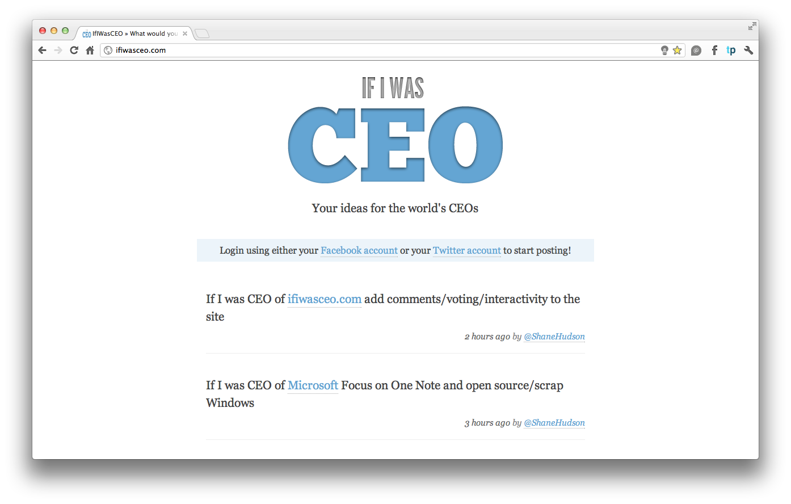
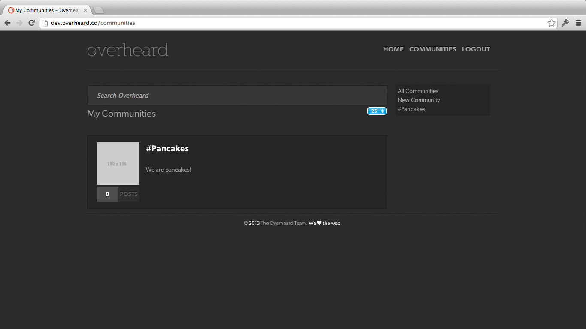

# Portfolio

<!-- Need some images! -->

## Gapps.me

Gapps.me was a technology blog for reviewing software, including applications, games, hacks, as well as hardware, including iPod accessories and games consoles.

The blog had no advertising or any form of revenue, but in it's prime was receiving a couple of hundred hits a day.

The blog no longer exists, since myself and the other writers didn't have any time to write new articles `:(`

## ThatPixel

<!--  -->

ThatPixel is a social media sharing platform that I wrote for my Computing A2 coursework. It involves taking user data, applying a shorturl to it for easy access and ease of use (in sites like Twitter & Facebook). It also allows users to auto-post to both Twitter & Facebook, with more social networks on the way.

One day I plan to rewrite it and bring it back online!

## IfIWasCEO

[IfIWasCEO](http://ifiwasceo.com) is an online web app where users can login using their Facebook / Twitter accounts, and post what they would do if they were CEO of companies / projects. I rewrote it during [a PEW week](http://jdrydn.com/pew/previous/2).

## Overheard

[Overheard](//overheard.co) was an online web app where people submit funny conversations and remarks they overheard other people having. I wrote the API behind the website (for a potential phone app to use too), and whilst that is stable and functioning, the website has yet to be completed. Our team consists of great minds like [Chris Ewbank](//djpc.org.uk), [Rufus Honour](//rufushonour.com) and [Shane Hudson](//shanehudson.net).

[&laquo; Return home](./)